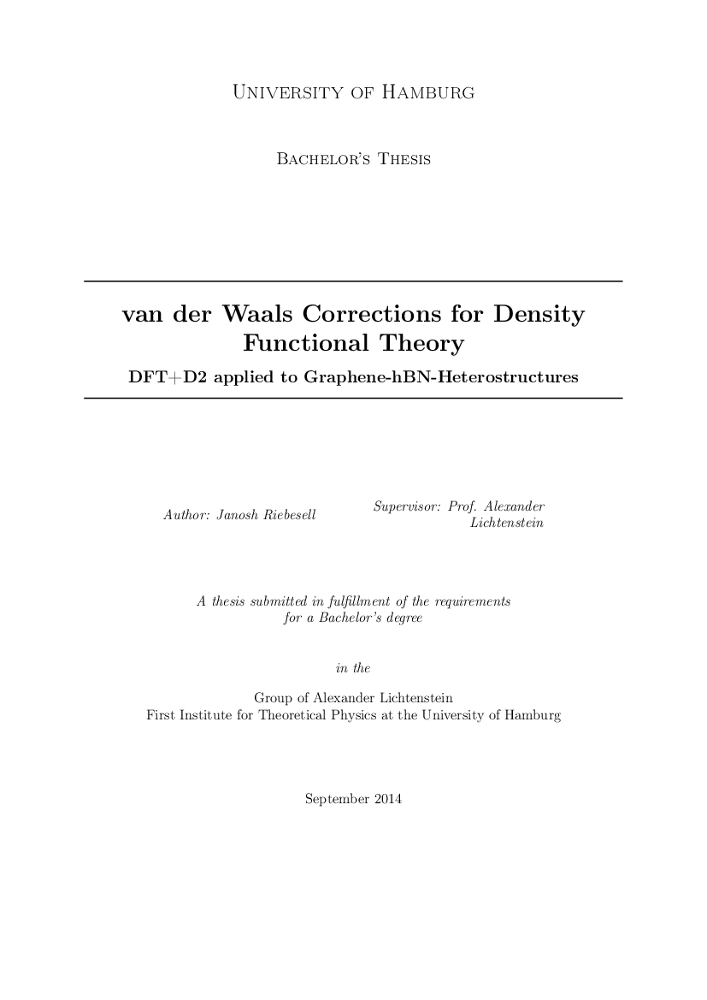

I wrote my bachelor's thesis under the supervision of [Prof. Alexander Lichtenstein](https://theorie.physnet.uni-hamburg.de/group_magno/?page_id=43) at ITP Hamburg.

## Topic

In recent endeavors aiming to develop materials for next-generation processors, graphene-based van der Waals heterostructures have emerged as one of the most promising candidates.[1](#ftn1) It has been shown that interlayer binding in these two-dimensional crystal stacks is dominated by long-range molecular dispersion forces. This poses a challenge to popular (semi-)local approximations in the framework of density functional theory (DFT), requiring instead the use of highly expensive non-local approaches.

In this work, we search for a computationally efficient method of modelling van der Waals heterostructures by modifying DFT’s conventional self-consistency cycle with Grimme et al.’s semi-empirical dispersion correction scheme.

To test this marriage, we assess its performance on the simple model system of G-hBN, a heterostructure consisting of single-layer graphene (G) bound to hexagonal boron nitride (hBN). We investigate a range of properties including equilibrium configurations, total energies as a function of interlayer separation, Young’s moduli, and band gaps.

Each of these features serves as a point of comparison for four different implementations of the DFT approach:

- First, we deploy unaltered DFT in the form of a local density approximation (LDA) based on the Ceperley-Alder exchange-correlation functional, and the generalized-gradient approximation (GGA) based on the Perdew-Burke-Ernzerhof functional.

- In a second step, we add Grimme et al.’s dispersion correction and repeat all calculations.
  Subsequently, results are compared among each other and with experiment when possible. Otherwise, we fall back on theoretical findings obtained with highly accurate but much more expensive calculations in the non-local random phase approximation (RPA).

We report partial success with both LDA and modified GGA delivering realistic results in certain areas. We advise to refrain from using GGA and modified LDA on our specific test system of G-hBN as we have shown them to produce grossly under- and overestimated binding, respectively. We expect this behaviour to hold true also for other van der Waals heterostructures.

[ Thesis](thesis.pdf)

<a name="ftn1">1</a>: at least at the time, way back in 2014 :)
